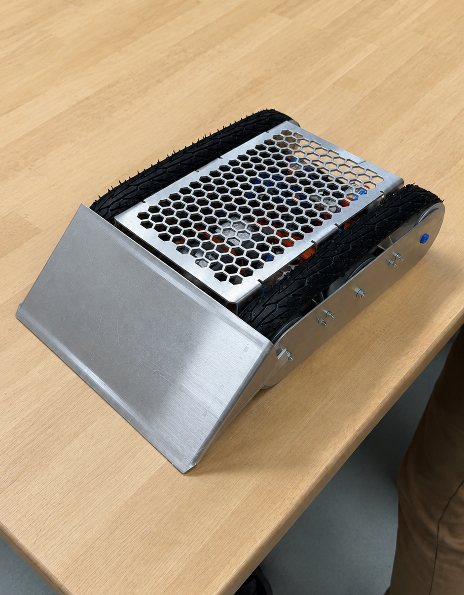
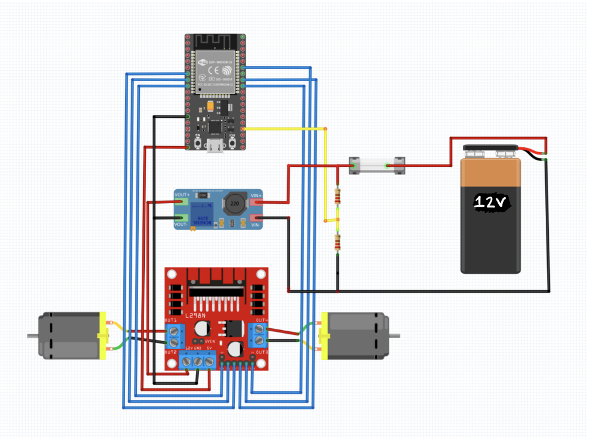
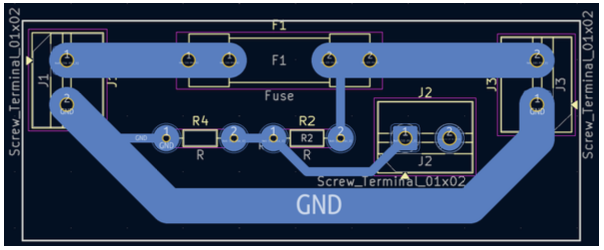
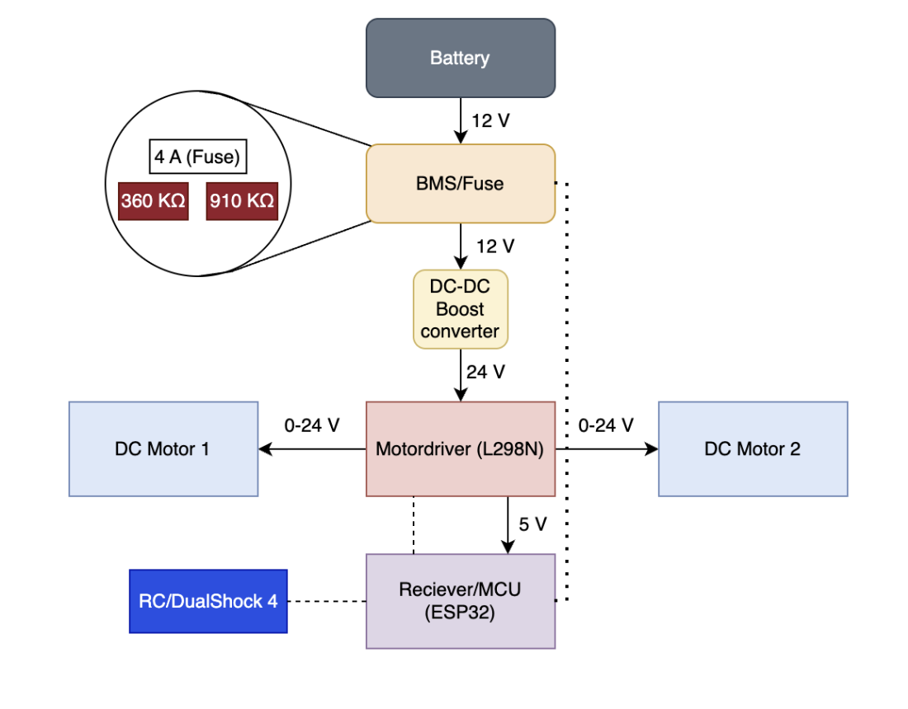
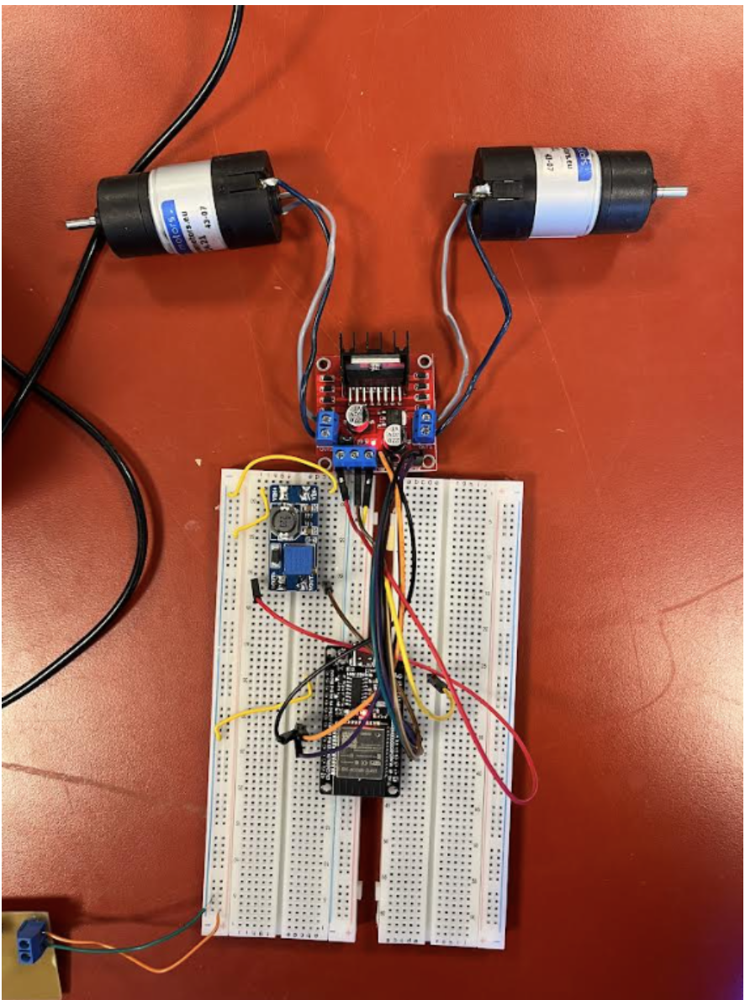

# BattleBot ESP32 Control System

Embedded control software and electronics for a tracked BattleBot developed as part of **TMM4150 – Machine Design and Mechatronics** at NTNU.

The robot was built by a team of seven Mechanical Engineering students. My responsibilities were primarily within **electronics and programming**, including ESP32 implementation, controller input, motor-control logic, PCB development, testing, and system integration.

This repository documents the software and electronics portion of the project. The mechanical design, CAD development, manufacturing, and assembly process are presented separately in the project case study on my portfolio website.

<p align="center">
  
  <br>
  <em>Completed tracked BattleBot developed for TMM4150 at NTNU.</em>
</p>

---

## Overview

The robot is controlled wirelessly using a DualShock 4 controller connected to an ESP32 over Bluetooth.

The ESP32 reads throttle, steering, and mode inputs and converts them into independent speed and direction commands for two brushed DC motors. An L298N dual H-bridge controls the left and right tracks using PWM and digital direction signals.

### Key Features

- Wireless DualShock 4 control over Bluetooth
- Forward and reverse throttle control
- Differential steering
- Turn-in-place mode
- Reduced-speed crawl mode
- Independent left and right motor control
- Variable motor speed using PWM
- Battery-voltage sensing through an ESP32 ADC input
- Custom protection and voltage-sensing PCB

---

## Electronics and Wiring

<p align="center">
  
  <br>
  <em>Integrated electronics setup containing the ESP32, motor driver, voltage converter, protection PCB, and power connections.</em>
</p>

| Component | Function |
|---|---|
| ESP32 development board | Bluetooth communication, control logic, input processing, and PWM generation |
| DualShock 4 controller | Wireless throttle, steering, and mode input |
| L298N dual H-bridge | Bidirectional control of both DC motors |
| Two brushed DC gear motors | Independent left and right track propulsion |
| MT3608 boost converter | Steps the battery voltage up for the motor system |
| Custom protection and sensing PCB | Fuse integration, common ground distribution, and battery-voltage sensing |
| Voltage divider | Reduces the battery-voltage signal to a safe ESP32 ADC input level |

<p align="center">
  
  <br>
  <em>Simplified wiring diagram showing the main electrical connections.</em>
</p>

Power is supplied from the battery through the protection and sensing PCB. The MT3608 boost converter raises the voltage supplied to the motor driver, while the ESP32 sends PWM and direction signals to the L298N.

The motor driver controls both DC motors independently, allowing the software to vary the speed and direction of each track.

---

## Custom Protection and Voltage-Sensing PCB

<p align="center">
  
  <br>
  <em>PCB layout used for fuse integration, external connections, common ground distribution, and battery-voltage sensing.</em>
</p>

The custom PCB was developed as part of the robot's battery protection and monitoring system.

The board provides:

- A connection point between the battery and the electrical system
- Fuse integration for overcurrent protection
- Shared ground distribution
- Screw-terminal connections for external wiring
- A resistor voltage divider for battery-voltage sensing

The battery voltage was too high to connect directly to the ESP32 ADC input. A resistor divider was therefore used to reduce the measurement signal:

```text
Vout = Vin × R2 / (R1 + R2)
```

The resistor values were selected so that the expected maximum battery voltage remained within the ESP32's safe ADC input range.

The current firmware reads and logs the raw ADC value. Converting this value into a calibrated battery voltage would be a natural next step.

---

## Control System

<p align="center">
  
  <br>
  <em>Activity diagram showing controller input, driving-mode selection, steering calculations, PWM limiting, and motor output.</em>
</p>

During each loop, the ESP32:

1. Reads the battery-sensing input.
2. Reads the current controller state.
3. Checks whether turn-in-place mode is active.
4. Calculates turn-in-place or differential steering commands.
5. Applies the crawl-mode PWM limit when required.
6. Sends the resulting direction and PWM outputs to both motors.

### Controller Mapping

| Input | Function |
|---|---|
| `R2` | Forward throttle |
| `L2` | Reverse throttle |
| Left stick, X-axis | Steering |
| Hold `Cross` | Turn-in-place mode |
| Hold `Circle` | Crawl mode with reduced maximum PWM output |

A dead zone around the center of the analog stick reduces unintended steering from small input variations.

### Differential Steering

During straight-line movement, both tracks receive approximately the same command:

```text
Left motor  = throttle
Right motor = throttle
```

When steering, the speed of the inside track is reduced relative to the requested throttle.

For a right turn:

```text
Left motor  = throttle
Right motor = throttle - steering correction
```

For a left turn:

```text
Right motor = throttle
Left motor  = throttle - steering correction
```

Turn-in-place mode drives the tracks in opposite directions, allowing the robot to rotate without forward or backward movement.

---

## ESP32 Pin Configuration

| Function | GPIO |
|---|---:|
| Right motor PWM enable | 12 |
| Left motor PWM enable | 33 |
| Right motor direction, IN1 / IN2 | 14 / 27 |
| Left motor direction, IN3 / IN4 | 25 / 26 |
| Battery-voltage ADC input | 34 |

PWM configuration:

```text
Frequency: 5000 Hz
Resolution: 8-bit
Output range: 0–255
```

The pin assignments are defined near the beginning of the source file and can be changed for a different wiring configuration.

---

## Software Structure

The program is organized around three main functions:

- **`getSteering()`** — reads throttle and steering input, applies the dead zone, and calculates separate speed commands for the left and right tracks.
- **`setMotor()`** — converts a signed speed command into direction signals and PWM output for the selected motor.
- **`getMeasurement()`** — reads the battery-sensing ADC channel and logs the raw value over serial.

The sign of the motor command determines direction:

```text
Positive value  -> forward
Negative value  -> reverse
Zero            -> stop
```

The magnitude determines the PWM duty cycle and is constrained to the valid 8-bit range.

---

## Testing

<p align="center">
  
  <br>
  <em>Breadboard prototype used during electronics and motor-control testing.</em>
</p>

The electronics and control logic were first tested on a breadboard before integration into the completed robot.

The prototype was used to test:

- Bluetooth pairing
- Controller input
- Forward and reverse motor direction
- PWM response
- Differential steering
- Turn-in-place mode
- Crawl mode
- Battery-voltage sensing

Several adjustments were made during testing to improve steering response and low-speed control.

The completed control system was integrated into the robot and used during testing and competition.

---

## Repository Structure

```text
battlebot-esp32-control/
├── software/
│   └── battlebot_controller/
│       └── battlebot_controller.ino
├── documentation/
│   ├── activity-diagram.png
│   ├── bms-pcb-layout.png
│   └── wiring-diagram.png
├── images/
│   ├── electronics-setup.jpg
│   ├── electronics-prototype.jpg
│   └── final-robot.jpg
└── README.md
```

- `software/` contains the ESP32 source code.
- `documentation/` contains the activity diagram, PCB layout, and wiring diagram.
- `images/` contains photographs of the prototype, integrated electronics, and completed robot.

---

## Setup

The project requires:

- Arduino IDE or another compatible ESP32 development environment
- ESP32 Arduino board package
- `PS4Controller` library

To upload the firmware:

1. Open `software/battlebot_controller/battlebot_controller.ino`.
2. Replace the placeholder with the Bluetooth address used for the controller:

```cpp
PS4.begin("XX:XX:XX:XX:XX:XX");
```

3. Select the correct ESP32 board and serial port.
4. Compile and upload the firmware.
5. Before operating the complete robot, lift the tracks from the ground or disconnect the drivetrain.
6. Confirm that both motors start at zero.
7. Test throttle, steering, turn-in-place mode, crawl mode, and the battery-sensing input.

---

## Known Limitations and Next Steps

- No dedicated fail-safe currently stops the motors when the Bluetooth connection is lost.
- Battery monitoring logs raw ADC values rather than calibrated voltage.
- Acceleration commands are applied directly without ramping.
- The steering dead zone is fixed in the source code.
- A more efficient motor driver and a more modular firmware structure would improve a future version.

---

## Contributions

The complete robot was developed by a seven-person team of Mechanical Engineering students at NTNU.

The embedded control software was developed collaboratively by **Mohamed Elwalid Fadul** and **Malte vor de Esche**.

My main contributions included:

- ESP32 implementation
- DualShock 4 controller integration
- Motor-control logic
- Differential steering
- Turn-in-place and crawl modes
- PCB development
- Electronics testing
- System integration
